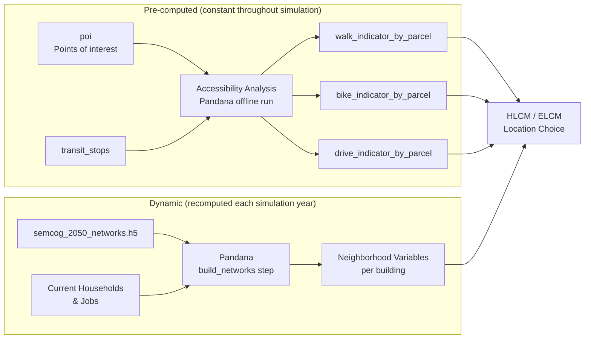

# Accessibility

**Primary sources:** Pre-computed accessibility indicator CSVs; transit stop and POI datasets

Accessibility tables measure how easily each parcel can reach destinations by walking, biking, or driving. Transit stops and points of interest are the **destination inputs** that drive accessibility analysis; the indicator tables are the **outputs** used directly as model features.

---

## Tables in This Domain

| Table | Description | Source |
|---|---|---|
| `transit_stops` | Fixed-route bus and rail stop locations | CSV |
| `poi` | Points of interest by category and location | CSV |
| `accessibility_walk_indicator_by_parcel` | Walk-mode accessibility metrics by parcel | Accessibility analysis output |
| `accessibility_bike_indicator_by_parcel` | Bike-mode accessibility metrics by parcel | Accessibility analysis output |
| `accessibility_drive_indicator_by_parcel` | Drive-mode accessibility metrics by parcel | Accessibility analysis output |

> **Important:** The indicator tables are pre-computed externally and held **constant throughout the simulation**. When the network, transit service, or POI data changes significantly, a new accessibility analysis must be run and the indicators regenerated.

---

## Destination Inputs

### `transit_stops`

Fixed-route bus and rail stop locations used in accessibility computation and as HLCM/ELCM features.

**Index:** `stop_id` (unique)

| Column | Type | Rules | Notes |
|---|---|---|---|
| `stop_id` | object | unique, no null | Transit agency stop ID |
| `point_x` | float64 | no null | State plane X coordinate |
| `point_y` | float64 | no null | State plane Y coordinate |

Only `point_x` and `point_y` are retained in the exported model input — any additional source columns are dropped.

**Update:** Get updated stop locations from SEMCOG transit database or GTFS feeds. Reproject to state plane if needed. Include all fixed-route bus and rail stops in the 7-county region.

**Common issues:**
- Stops outside the region — verify coordinates
- Duplicate `stop_id` values — append agency prefix to ensure uniqueness

### `poi`

Points of interest used as accessibility destinations — grocery stores, hospitals, parks, pharmacies, childcare, schools, etc.

**Index:** Row index (integer)

| Column | Type | Rules | Notes |
|---|---|---|---|
| `category` | object | no null | POI type (e.g., `"grocery_store"`, `"hospital"`) |
| `point_x` | float64 | no null | State plane X |
| `point_y` | float64 | no null | State plane Y |

POI categories must match the destination names used in the accessibility analysis. If category names change, the analysis must be rerun and the indicator variable names in the model's accessibility configuration updated accordingly.

**Update:** Refresh from the latest accessibility analysis POI dataset. Coordinate with the accessibility analysis team when updating — any change to categories or coverage triggers a full re-analysis.

---

## Accessibility Indicator Tables

All three indicator tables share the same structure — indexed by `parcel_id`, with one row per parcel. They contain two variable types:

**Near-max variables** — travel time to the nearest facility (90th-percentile of distances). Lower = better access. Fill value when no route exists: 95 min (walk), 125 min (bike), 155 min (drive).

**Cumulative variables** — count of jobs or transit stops reachable within a time threshold. Higher = better access. Fill value when none reachable: 0.

File names include a date stamp (e.g., `_20251111`). Update the relevant configuration when new files are produced.

---

### `accessibility_walk_indicator_by_parcel`

**Index:** `parcel_id`

#### Near-Max Walk Variables (90 min threshold)

| Variable | Destination |
|---|---|
| `hospitals_walk_near_max90` | Hospitals |
| `urgent_cares_walk_near_max90` | Urgent care centers |
| `health_centers_walk_near_max90` | Community health centers |
| `all_healthcare_walk_near_max90` | All healthcare combined |
| `grocery_stores_walk_near_max90` | Grocery stores |
| `libraries_walk_near_max90` | Public libraries |
| `parks_local_walk_near_max90` | Local parks |
| `parks_bike_walk_near_max90` | Bike-friendly parks |
| `parks_school_walk_near_max90` | School parks |
| `parks_local_school_walk_near_max90` | Combined local/school parks |
| `schools_k8_walk_near_max90` | K-8 schools |
| `schools_912_walk_near_max90` | High schools |
| `pharmacies_walk_near_max90` | Pharmacies |
| `childcare_walk_near_max90` | Childcare |
| `fire_stations_walk_near_max90` | Fire stations |
| `fixed_route_bus_walk_near_max90` | Fixed-route bus stops |
| `american_job_centers_walk_near_max90` | American Job Centers |
| `community_colleges_walk_near_max90` | Community colleges |
| `passenger_train_stations_walk_near_max90` | Passenger rail |

#### Cumulative Walk Variables

| Variable | Meaning |
|---|---|
| `jobs_walk_cumulative_5min` | Jobs within 5 min walk |
| `jobs_walk_cumulative_10min` | Jobs within 10 min walk |
| `jobs_walk_cumulative_15min` | Jobs within 15 min walk |
| `jobs_walk_cumulative_30min` | Jobs within 30 min walk |
| `fixed_route_bus_weekday_walk_10min` | Bus stops within 10 min walk (weekday) |
| `fixed_route_bus_weekend_walk_10min` | Bus stops within 10 min walk (weekend) |

---

### `accessibility_bike_indicator_by_parcel`

**Index:** `parcel_id`

#### Near-Max Bike Variables (120 min threshold)

Same destination set as walk, plus `passenger_airports_bike_near_max120`. All variable names follow the pattern `{destination}_bike_near_max120`.

#### Cumulative Bike Variables

| Variable | Meaning |
|---|---|
| `jobs_bike_cumulative_5min` | Jobs within 5 min bike |
| `jobs_bike_cumulative_10min` | Jobs within 10 min bike |
| `jobs_bike_cumulative_15min` | Jobs within 15 min bike |
| `jobs_bike_cumulative_30min` | Jobs within 30 min bike |
| `fixed_route_bus_weekday_bike_10min` | Bus stops within 10 min bike (weekday) |
| `fixed_route_bus_weekend_bike_10min` | Bus stops within 10 min bike (weekend) |

---

### `accessibility_drive_indicator_by_parcel`

**Index:** `parcel_id`

#### Near-Max Drive Variables (150 min threshold)

Subset of destinations (vehicle-accessible only). Pattern: `{destination}_drive_near_max150`.

Destinations include: hospitals, urgent care, health centers, all healthcare, grocery stores, libraries, vehicle-accessible parks, K-8 schools, high schools, pharmacies, childcare, fire stations, American Job Centers, community colleges, passenger airports, passenger train stations.

#### Cumulative Drive Variables

| Variable | Meaning |
|---|---|
| `jobs_drive_cumulative_10min` | Jobs within 10 min drive |
| `jobs_drive_cumulative_15min` | Jobs within 15 min drive |
| `jobs_drive_cumulative_20min` | Jobs within 20 min drive |
| `jobs_drive_cumulative_25min` | Jobs within 25 min drive |
| `jobs_drive_cumulative_30min` | Jobs within 30 min drive |
| `jobs_drive_cumulative_45min` | Jobs within 45 min drive |
| `jobs_drive_gravity_90min` | Gravity-weighted job access (90 min max) |

---

## How Indicators Join to Buildings

All three tables are indexed by `parcel_id`. The simulation joins them to buildings via `buildings.parcel_id`. This join is handled automatically during model variable computation.

---

## Update Procedure

Accessibility indicators should be regenerated when:
- The street or transit network changes significantly
- The POI or transit stop dataset is refreshed
- A new forecast cycle requires updated base-year accessibility

**Steps:**
1. Update `poi` and `transit_stops` CSVs with current data
2. Run the accessibility analysis (Pandana-based pipeline)
3. Export new indicator CSVs with a date stamp in the filename
4. Update the relevant file path references in the model configuration
5. Re-assemble the model input file to incorporate the new indicators
6. If variable names or columns changed, coordinate with the modeling team — model coefficients are estimated on specific variable names; renaming requires re-estimation

**Common issues:**
- Parcels with all values at fill value (95/125/155 min) — parcel has no network connection; check coordinates
- Column name mismatch between CSV and model configuration — causes errors at simulation startup
- `parcel_id` values in indicator CSVs that don't match the current `parcels` table — verify the accessibility analysis used the same parcel dataset
