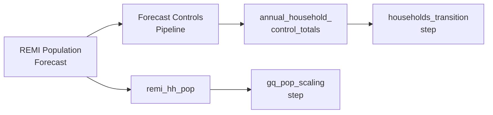
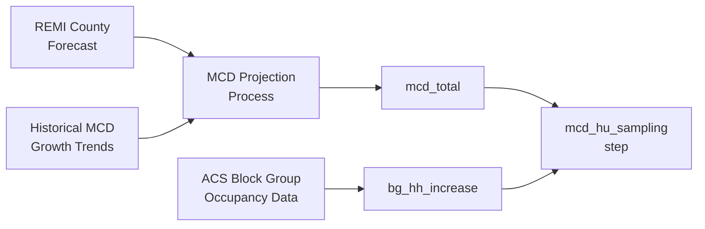
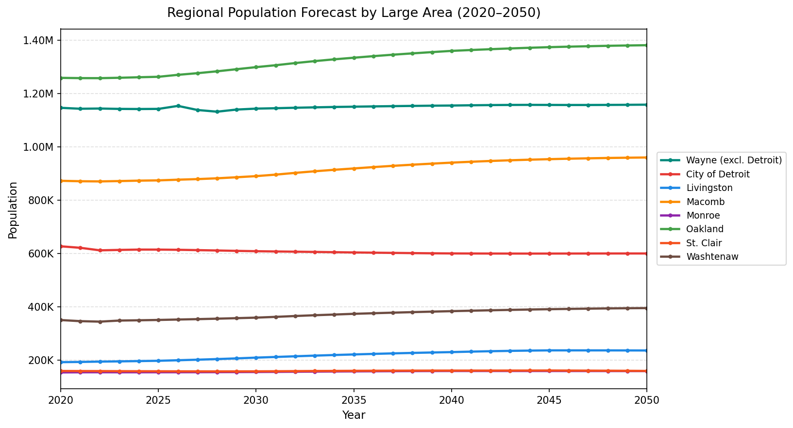
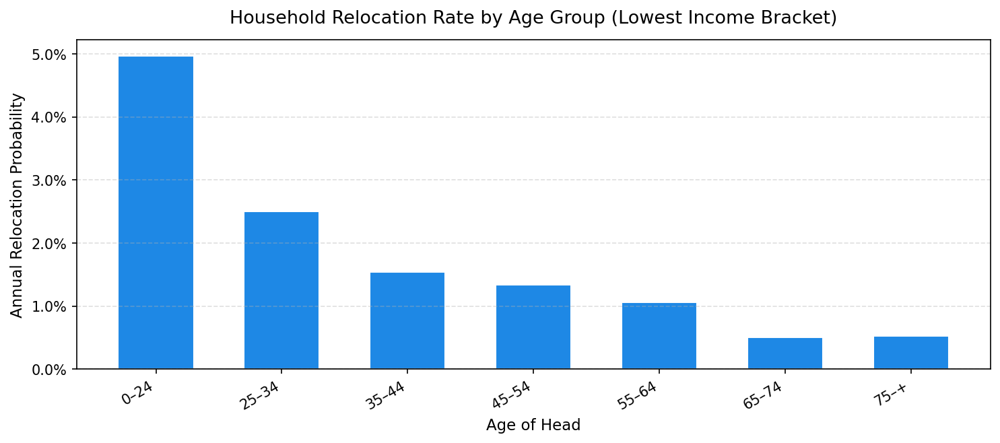

# Demographics

**Primary sources:** Population synthesis outputs, REMI model exports, ACS data, rate tables (CSV/Excel)

This domain covers the base-year synthetic population (households, persons, group quarters), annual household growth control totals from REMI, block group household trend data from ACS, and supporting rate and target tables.

---

## Tables in This Domain

| Table | Description | Source |
|---|---|---|
| `households` | Base-year synthetic households, placed in buildings | Population synthesis + placement |
| `persons` | All individuals linked to households | Population synthesis |
| `annual_household_control_totals` | Target HH counts by segment × year | Forecast controls pipeline |
| `remi_hh_pop` | Household population (total − group quarters) by large area × year | Produced by `HH_controls.py` (replaces the legacy total-population `remi_pop_total`) |
| `annual_relocation_rates_for_households` | Household relocation probability by age/income | Excel rate table |
| `income_growth_rates` | Annual income growth by large area | CSV |
| `target_vacancies` | Target residential vacancy rates by large area × year | Excel |
| `target_vacancies_mcd` | City-level residential vacancy targets | Excel |
| `mcd_total` | Target household counts by MCD × year | Forecast controls pipeline |
| `bg_hh_increase` | Block group occupied housing unit trend (ACS) | ACS CSV |
| `group_quarters` | Group quarters persons, assigned to GQ buildings | GQ synthesis |
| `group_quarters_households` | GQ facility-level aggregate | GQ synthesis |
| `group_quarters_control_totals` | Target GQ population by city × year | CSV |

---

## Households & Persons

### `households`

Base-year synthetic household table. Generated by PopulationSim and placed into buildings using a stable-marriage matching algorithm that aligns synthesized households to building assessor records at the block group level. Matching is based on shared attributes including building type, number of units, market value / housing cost, year built, and tenure.

**Index:** `household_id` (unique)

| Column | Type | Rules | Notes |
|---|---|---|---|
| `household_id` | int32 | unique, no null | |
| `building_id` | int32 | join → `buildings`, no null | Placement result; -1 = unplaced |
| `persons` | int8 | range [1–20], no null | Household size |
| `workers` | int8 | range [0–18], no null | Employed workers |
| `age_of_head` | int8 | range [15–100], no null | Age of head |
| `income` | float64 | no null | Annual income ($); negatives set to 0 |
| `children` | int8 | range [0–14], no null | Children under 18 |
| `cars` | int8 | values: 0–6 | Vehicle count |
| `race_id` | int8 | values: 1,2,3,4 | 1=White, 2=Black, 3=Asian, 4=Other |

**Common issues:**
- `workers > persons` — invalid combination; flag in synthesis output
- `building_id = -1` — unplaced households; should be a small fraction of total; investigate large unplaced counts
- Negative income — set to 0 in the build pipeline (intentional)
- Total household count should be consistent with the base year `annual_household_control_totals`

### `persons`

All individuals in base-year synthetic households. One row per person.

**Index:** `person_id` (unique)

| Column | Type | Rules | Notes |
|---|---|---|---|
| `person_id` | int32 | unique, no null | |
| `household_id` | int32 | join → `households`, no null | |
| `age` | int8 | range [0–94], no null | |
| `sex` | int8 | values: 1, 2 | 1=male, 2=female |
| `race_id` | int8 | values: 1,2,3,4 | |
| `worker` | int8 | values: 0, 1 | 1=employed |
| `relate` | int8 | values: 0–15 | Relationship to head (ACS codes); 0=head |
| `member_id` | int8 | range [1–20], no null | Position in household (1=head) |
| `industry` | int8 | no null | Aggregated NAICS industry |
| `school_grade` | int8 | no null | Enrolled grade; -1=not enrolled |

**Common issues:**
- Persons with `household_id` not in `households` — orphaned persons; drop or investigate
- Each household should have exactly one `relate = 0` (the head)
- Row count of `persons` should be consistent with the sum of `households.persons`

---

## Control Totals & Population Forecasts

**Household control total pipeline** — how REMI flows into the simulation:

**MCD sampling pipeline** — how city-level growth targets and block group trends feed the housing unit sampler:

### `annual_household_control_totals`

Drives how many households exist in each large area × demographic segment each year. The most critical table for forecast outcomes.

**Index:** `year`  
**Generated by:** A forecast controls pipeline that converts REMI population exports into segmented household targets by large area and demographic category.

**Columns:**

| Column | Type | Allowed Values | Notes |
|---|---|---|---|
| `year` | int16 | must cover all forecast years | Index |
| `large_area_id` | int16 | 8 valid codes | One of the 8 modeling zones |
| `age_of_head_min/max` | int8 | bracket bounds | `-1` = open-ended upper bound |
| `persons_min/max` | int8 | bracket bounds | |
| `workers_min/max` | int8 | bracket bounds | |
| `income_min/max` | int32 | bracket bounds | |
| `children_min/max` | int8 | bracket bounds | |
| `cars_min/max` | int8 | bracket bounds | |
| `race_id` | int8 | 1,2,3,4 | |
| `total_number_of_households` | int16 | no null | Target HH count for this segment × year |

**The `-1` sentinel** in `_max` columns means "no upper bound" (open-ended bracket). For example, `age_of_head_max = -1` means "65 and older."

**Sample rows** (year 2021, different segments):

| year | large_area_id | race_id | age_of_head_min | age_of_head_max | persons_min | persons_max | children_min | children_max | cars_min | cars_max | workers_min | workers_max | income_min | income_max | total_number_of_households |
|---|---|---|---|---|---|---|---|---|---|---|---|---|---|---|---|
| 2021 | 3 | 1 | 65 | **-1** | 1 | 1 | 0 | 0 | 1 | 1 | 0 | 0 | 0 | 31704 | 16,260 |
| 2021 | 125 | 1 | 35 | 64 | 2 | 2 | 0 | 0 | 2 | 2 | 2 | 2 | 113,183 | 1,534,131 | 13,977 |
| 2021 | 5 | 2 | 35 | 64 | 1 | 1 | 0 | 0 | 0 | 0 | 0 | 0 | 0 | 31704 | 12,052 |

Row 1 shows a senior single-person household (age 65+, `-1` = open-ended upper bound) in Wayne County excluding Detroit. Row 2 shows a high-income two-worker couple in Oakland County. Row 3 shows a zero-car, low-income single person in the City of Detroit. Each row defines one demographic segment for one year — the same segments repeat for every forecast year with updated targets.

The model matches households to segments by checking that all bracket columns are satisfied simultaneously.

**Common issues:**
- Missing years — all forecast years must be present; the simulation skips growth for any missing year
- Segment totals should sum to plausible regional totals — cross-check household population against `remi_hh_pop`
- All 8 large areas must have rows for every forecast year

### `remi_hh_pop`

Household population (TOTAL population **minus group quarters**) by large area × year. Used by the household transition model to size the open-ended 10+-person household bin to a population target.

**Index:** `large_area_id`  
**Structure:** 8 rows × year columns (one column per simulation year)

| Column | Type | Notes |
|---|---|---|
| `large_area_id` | int16 | Row index — 8 valid codes |
| one column per year | int32 | Household population (**excludes** group quarters) |

**Produced by:** `HH_controls.py` writes `remi_hh_pop.csv` from the reviewed household-population series (total − GQ) it already uses to scale household counts — so it comes out of the same control-totals run, not a separate step.

**Replaces `remi_pop_total`.** The legacy table held *total* population including group quarters; the transition's 10+-person size target excludes GQ, so total population over-stated the target by each large area's GQ population and biased 10+-person household sizes upward. The simulation now prefers `remi_hh_pop` and falls back to `remi_pop_total` only as a temporary back-compat measure (behind the `allow_total_pop_fallback` switch). Update it from the same REMI run as the household controls; retire `remi_pop_total` once inputs carry `remi_hh_pop`.

**Sample rows** (all 8 large areas, selected years):

| large_area_id | 2020 | 2025 | 2030 | 2040 | 2050 |
|---|---|---|---|---|---|
| 3 (Wayne excl. Detroit) | 1,144,751 | 1,141,266 | 1,142,225 | 1,157,438 | 1,161,491 |
| 5 (City of Detroit) | 627,271 | 616,225 | 609,372 | 609,281 | 617,016 |
| 93 (Livingston) | 191,851 | 196,915 | 208,718 | 229,925 | 235,504 |
| 99 (Macomb) | 872,057 | 873,255 | 889,172 | 936,570 | 951,081 |
| 115 (Monroe) | 153,349 | 153,912 | 154,853 | 158,597 | 158,665 |
| 125 (Oakland) | 1,258,093 | 1,261,644 | 1,297,755 | 1,348,260 | 1,365,804 |
| 147 (St. Clair) | 158,786 | 157,532 | 157,330 | 162,874 | 161,103 |
| 161 (Washtenaw) | 349,747 | 349,397 | 359,430 | 382,243 | 394,364 |

**Common issues:**
- Missing large areas — all 8 must be present
- Year columns must cover the full simulation range

### `mcd_total`

Target household counts by MCD × year. Used by the `mcd_hu_sampling` model step to control city-level household growth.

**Index:** `mcd` (SEMMCD code)  
**Structure:** One row per MCD, year columns  
**Derived from:** A separate MCD projection process that combines historical MCD household growth trends with REMI county-level forecasts as constraints. MCD-level 5-year benchmarks are developed independently and then interpolated to annual values.

**Sample rows** — growing, stable, and declining MCDs (selected years):

| mcd | 2020 | 2025 | 2030 | 2040 | 2050 |
|---|---|---|---|---|---|
| 3060 | 31,543 | 33,044 | 35,704 | 38,658 | 39,133 |
| 2040 | 16,788 | 16,858 | 17,013 | 17,131 | 17,264 |
| 5 | 254,275 | 251,513 | 250,539 | 248,911 | 251,519 |
| 1115 | 15,614 | 15,468 | 15,487 | 15,439 | 15,171 |

**Common issues:**
- All MCDs in the region (238 rows) must be present
- Year columns must cover the full simulation range

---

## Rate & Target Tables

### `annual_relocation_rates_for_households`

Probability of a household relocating in a given year, by age of head and income bracket.

**Index:** Row integer (no named index)

| Column | Type | Allowed Values |
|---|---|---|
| `age_min/max` | int8 | age bracket bounds; -1=open-ended |
| `income_min/max` | int32 | income bracket bounds; -1=open-ended |
| `probability_of_relocating` | float32 | range [0–1], no null |

**Sample rows** — one row per age group (lowest income bracket), showing how relocation probability declines with age:

| age_min | age_max | income_min | income_max | probability_of_relocating |
|---|---|---|---|---|
| 0 | 24 | 0 | 9,999 | 0.0497 |
| 25 | 34 | 0 | 9,999 | 0.0250 |
| 35 | 44 | 0 | 9,999 | 0.0154 |
| 45 | 54 | 0 | 9,999 | 0.0134 |
| 55 | 64 | 0 | 9,999 | 0.0106 |

**Note:** In the simulation this rate is scaled by 0.2 (only 20% of households flagged as potential movers actually relocate). Brackets must be exhaustive — every age/income combination a household could have must fall into exactly one row.

### `income_growth_rates`

Annual income growth multiplier by large area × year. One row per year, one column per large area.

**Index:** `year`

**Common issues:**
- All 8 large areas must have a column
- Must cover all forecast years

### `target_vacancies`

Target residential and non-residential vacancy rates by large area × year. Used by the developer model to determine how much new construction to generate.

| Column | Type | Notes |
|---|---|---|
| `large_area_id` | int16 | 8 valid codes |
| `year` | int16 | All forecast years |
| `res_target_vacancy_rate` | float32 | e.g., 0.05 = 5% |
| `non_res_target_vacancy_rate` | float32 | |

### `target_vacancies_mcd`

City-level residential vacancy targets. Takes precedence over large area targets when both are present.

**Index:** `cityid`

> **Note on naming:** This table's index is literally named `cityid` (no underscore), unlike `city_id` used in other tables. The value follows the same convention — equals `semmcd` outside Detroit, neighborhood code inside Detroit. See the [Glossary](../index.md#glossary).

| Column | Notes |
|---|---|
| `cityid` | Index — MCD or Detroit neighborhood code |
| `cityname` | Municipality name (informational) |
| one column per year | float — target residential vacancy rate |

---

## `bg_hh_increase`

Block group occupied housing unit counts from ACS, for two reference periods. Used by the `mcd_hu_sampling` model step to detect neighborhood-level housing demand trends and distribute city-level household growth sub-city.

**Index:** `GEOID` (Census block group GEOID)

| Column | Type | Notes |
|---|---|---|
| `GEOID` | int64 | Census block group GEOID — unique index |
| `OccupiedHU19` | int32 | Occupied housing units, 2019 ACS |
| `OccupiedHU14` | int32 | Occupied housing units, 2014 ACS |

**Update:** Pull occupied housing unit counts from ACS (5-year estimates) for all block groups in the 7-county region. The model uses the difference between the two periods to estimate recent trend direction — blocks with growing occupancy attract more new households; declining blocks attract fewer. Update both the earlier and the later reference year when starting a new forecast cycle to reflect recent conditions.

**Common issues:**
- Missing block groups — all block groups in the model region should be present
- `GEOID` must be integer (leading zeros removed); verify dtype after loading
- Block groups that were split or merged between ACS vintages need to be resolved before use

---

## Group Quarters

### `group_quarters`

Group quarters persons — one row per person living in a non-household arrangement (dormitory, nursing home, prison, military barracks). Tracked separately from regular households; not subject to HLCM.

**Index:** `personid` (unique)

| Column | Type | Allowed Values | Notes |
|---|---|---|---|
| `personid` | int32 | unique, no null | |
| `building_id` | int32 | join → `buildings`, no null | GQ facility building |
| `gq_code` | int16 | 101,201,301,401,501,701,789 | GQ type (see below) |
| `age` | int8 | no null | |
| `race_id` | int8 | 1,2,3,4 | |
| `type` | object | — | GQ type label |

**GQ type codes:**

| Code | Type |
|---|---|
| 101 | College/University dormitory |
| 201 | Military quarters |
| 301 | Correctional facilities |
| 401 | Nursing/assisted living |
| 501 | Other institutional |
| 701 | Other non-institutional |
| 789 | Other/unknown |

### `group_quarters_households`

Facility-level GQ aggregate — one row per GQ building.

**Index:** `household_id`

| Column | Notes |
|---|---|
| `building_id` | GQ facility building; must exist in `buildings` |
| `persons` | Total GQ persons in this facility |
| `gq_code` | GQ type |
| `city_id` | MCD (= semmcd outside Detroit; neighborhood id inside Detroit) |
| `large_area_id` | Large area |

### `group_quarters_control_totals`

Target GQ population counts by city × year. Used by `gq_pop_scaling_model` to scale GQ population each simulation year.

**Index:** `city_id` ¹

> ¹ **`city_id` naming note:** This column equals `semmcd` (the official MCD code) everywhere except the City of Detroit, where it identifies a neighborhood. This is a legacy convention — see the [Glossary](../index.md#glossary) for the full explanation.

| Column | Type | Rules |
|---|---|---|
| `city_id` | int32 | no null |
| `count` | int32 | no null |
| `year` | int16 | range covers all forecast years, no null |

**Common issues:**
- All cities with GQ populations must have rows for every forecast year
- `city_id` values must match those in `semmcds` (or Detroit neighborhood codes)

---

## Update Checklist (New Forecast Cycle)

- [ ] Get new REMI population export by large area × age × gender; run forecast controls pipeline to produce `annual_household_control_totals`
- [ ] Update `remi_hh_pop` with new REMI household population (total − GQ) by large area × year
- [ ] Update `mcd_total` via the separate MCD projection process (historical growth trends + REMI county forecasts → 5-year benchmarks → annual interpolation)
- [ ] Review and update vacancy rate tables if market conditions warrant
- [ ] Update GQ control totals and re-run GQ synthesis if base year changes
- [ ] Update `bg_hh_increase` with fresh ACS occupied housing unit data for the new base period
- [ ] Confirm all forecast years have rows in `annual_household_control_totals` for all 8 large areas
- [ ] Confirm `mcd_total` covers all 238 MCDs × all forecast years
- [ ] Confirm `remi_hh_pop` has all 8 large area rows and all forecast year columns
- [ ] Confirm GQ `building_id` values exist in `buildings`
