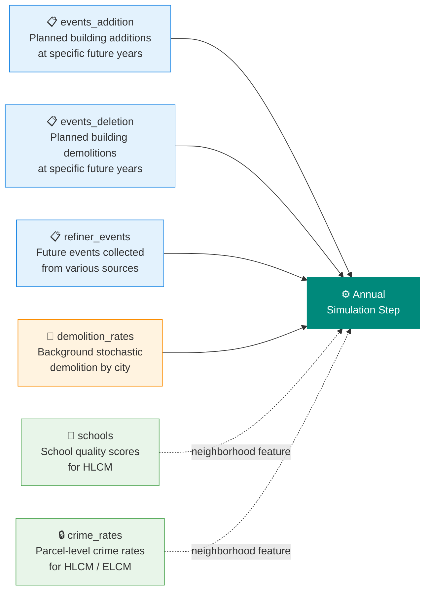

# Development & Context

**Primary sources:** PostgreSQL event and demolition tables; CSV files; crime data from PostgreSQL; construction cost estimates

This domain brings together three related categories:

- **Planned development events** — specific buildings that will be added or removed at known future years, plus background demolition rates
- **Neighborhood context** — school quality and crime rates that influence location choice
- **Building construction costs** — per-square-foot construction cost estimates by building type and area, which determine feasibility of new development

All three categories shape *where* and *how much* development and population locate in the model.

---

## Tables in This Domain

| Table | Description | Source |
|---|---|---|
| `events_addition` | Planned buildings to add at a specific year | SQL |
| `events_deletion` | Planned buildings to demolish at a specific year | SQL |
| `refiner_events` | Future events from various sources (add/remove agents at specific locations and years) | CSV (merged from emp + GQ events) |
| `demolition_rates` | Annual background demolition counts by city | SQL |
| `landmark_worksites` | Major employers protected from simulation randomness | CSV |
| `schools` | K-12 school locations and quality scores | Excel |
| `crime_rates` | Violent and property crime rates by parcel | SQL join |
| Building construction costs | Per-sqft cost inputs for the developer feasibility model | Construction cost estimates → CSV |

---

## Development Events

> **Key distinction between event tables:**
>
> - **`events_addition` / `events_deletion`** are **real estate events** — they add or remove physical *buildings* in the simulation. Use these for known construction projects or planned demolitions where the structure itself is changing.
> - **`refiner_events`** is an **agent-level event** — it adds or removes *jobs, households, or group quarters persons* at targeted locations without changing the building inventory. Use this for planned employment relocations, major employer openings or closings, facility population changes, and other events that affect who occupies buildings rather than what buildings exist.

### `events_addition`

Buildings to be added at a specific future year. Represents known construction projects (stadiums, hospitals, planned developments) that override the market developer model. A new building record is inserted into the buildings table at the scheduled year.

**Index:** `objectid` (unique)

| Column | Type | Rules | Notes |
|---|---|---|---|
| `objectid` | int | unique, no null | Index |
| `parcel_id` | int32 | no null | Must exist in `parcels` |
| `building_type_id` | int8 | join → `building_types`, no null | |
| `year_built` | int16 | range [base year+1 – forecast end], no null | Year the building is added |
| `residential_units` | int16 | no null | 0 for non-residential |
| `non_residential_sqft` | int32 | no null | 0 for residential |
| `stories` | int | — | |
| `zone_id` | int16 | — | TAZ reference |
| `city_id` | int16 | — | MCD reference (= semmcd outside Detroit) |
| `gqcap` | int | — | Group quarters capacity (0 if not GQ) |
| `event_id` | int | — | Project reference ID; used by `refiner_events` to target this building |

Event buildings receive `sp_filter = -1` (protected from random relocation and demolition).

**Common issues:**
- `parcel_id` not in `parcels` — building can't be placed; fix parcel reference
- `year_built` at or before the base year — these events are filtered out; verify years
- Year range should cover only future years (after the base year)

### `events_deletion`

Buildings to be demolished at a specific future year. The building record is removed from the buildings table at the scheduled year, displacing any agents that occupied it.

**Index:** `objectid` (unique)

| Column | Type | Rules | Notes |
|---|---|---|---|
| `objectid` | int | unique, no null | |
| `building_id` | int32 | no null | Building to be demolished |
| `year_built` | int16 | no null | Year of demolition |

**Common issues:**
- `building_id` not in `buildings` — skipped but should be cleaned up
- Demolition years at or before the base year — verify data entry

### `refiner_events`

Agent-level events collected from various sources. Unlike `events_addition`/`events_deletion`, this table does not change the building inventory — it adds or removes **agents** (jobs, households, or group quarters persons) at specific locations. Typical uses include planned major employer openings or relocations, GQ facility population changes, and other future occupancy events that do not involve new construction or demolition. Assembled by merging employment events and GQ events CSVs.

**Index:** `refinement_id` (unique, int16)

| Column | Type | Rules | Notes |
|---|---|---|---|
| `refinement_id` | int16 | unique, no null | |
| `transaction_id` | int16 | no null | Groups related events (e.g., a move = one remove + one add) |
| `year` | int16 | forecast year range, no null | |
| `action` | object | `"add"` or `"remove"` | |
| `agents` | object | `"jobs"`, `"households"`, or `"group_quarters"` | Which agent type to affect |
| `agent_expression` | object | no null | Pandas query string filtering the **agent** table |
| `location_expression` | object | no null | Pandas query string filtering the **buildings** table |
| `amount` | int16 | no null | Number of agents to add or remove |

**`agent_expression` and `location_expression` syntax:**
Both are [pandas query strings](https://pandas.pydata.org/docs/reference/api/pandas.DataFrame.query.html) applied at runtime to the relevant DataFrame. `agent_expression` filters the agents table (e.g., `jobs`, `households`); `location_expression` filters the `buildings` table.

Examples from the current data:

| action | agents | agent_expression | location_expression | amount | Meaning |
|---|---|---|---|---|---|
| `add` | `jobs` | `sector_id==6` | `event_id==9042132` | 250 | Add 250 retail jobs to the event building with id 9042132 |
| `add` | `jobs` | `sector_id==3` | `building_id==8901277` | 1700 | Add 1700 manufacturing jobs to a specific building |
| `remove` | `jobs` | `sector_id==9` | `city_id==501` | 500 | Remove 500 service jobs from buildings in city 501 |

The `event_id` column in `events_addition` is the same as the `event_id` value used in `location_expression` — this is how a refiner event targets a planned new building.

**Update:** Add rows to the employment events CSV for new employment centers or relocations. Add rows to the GQ events CSV for GQ facility changes. Merge both into `refiner_events` via the build pipeline.

### `demolition_rates`

Annual background demolition counts by city and building type. Applied probabilistically each year by `random_demolition_events`.

**Index:** `city_id`

| Column | Type | Notes |
|---|---|---|
| `city_id` | int16 | MCD reference (= semmcd outside Detroit) |
| `type81units` | int32 | Single-family units to demolish annually |
| `type82units` | int32 | Attached condo units |
| `type83units` | int32 | Multi-family units |
| `type84units` | int32 | Mobile home units |
| `typenonsqft` | int32 | Non-residential sq ft to demolish annually |

These are **absolute counts** (not rates) applied stochastically — buildings are sampled to meet each city's annual target.

**Common issues:**
- Cities with null values are treated as 0 demolitions — verify that zero is intentional vs. missing data
- Update in PostgreSQL when calibrating to new demolition patterns

### `landmark_worksites`

Major employers whose jobs are protected from simulation randomness. Large factories, university campuses, hospital complexes.

| Column | Notes |
|---|---|
| `building_id` | Building to protect — receives `sp_filter = -1` at startup |

**How it works:** Buildings in this list get `sp_filter = -1` at startup, preventing the ELCM and relocation models from removing their jobs.

**Update:** Add new anchor employers when major facilities open; remove entries if a facility closes. Keep the list conservative — over-protecting buildings reduces model responsiveness.

**Common issues:**
- `building_id` values that no longer exist in `buildings` — these are silently skipped but should be removed

---

## Neighborhood Context

### `schools`

K-12 school locations and quality scores. Used as HLCM features — school quality affects where families with children choose to live.

**Index:** `bcode` (unique)

| Column | Type | Rules | Notes |
|---|---|---|---|
| `bcode` | int16 | unique, no null | School building code |
| `bname` | object | — | School name |
| `dcode` | int32 | range [47010–84060], no null | School district code |
| `gradelist` | object | no null | Grade levels served |
| `is_grade_school` | int8 | values: 0, 1 | 1=K-8 |
| `point_x` | float64 | no null | State plane X coordinate |
| `point_y` | float64 | no null | State plane Y coordinate |
| `totalachievementindex` | float64 | no null | School achievement score |

**Update:** Refresh from the Michigan Department of Education database when new schools open, schools close, or achievement scores are updated. For new schools without a score, use the district average.

**Common issues:**
- Coordinates outside the 7-county region — verify data
- `totalachievementindex = null` — causes null neighborhood variables in HLCM; fill with district average

### `crime_rates`

Violent and property crime rates by parcel. Derived from city-level crime data — all parcels in a city receive the same rate.

**Index:** `parcel_id` (unique, joins to `parcels`)

| Column | Type | Rules | Notes |
|---|---|---|---|
| `parcel_id` | int32 | join → `parcels`, no null | Index |
| `ucr_crime_rate` | float64 | no null | Violent crime rate (UCR) |
| `other_crime_rate` | float64 | no null | Property crime rate |

**Update:** Update the crime rates table in PostgreSQL with new annual data by city. The parcel-level values are derived automatically from city rates when the SQL query runs.

**Common issues:**
- Cities with no crime data result in null rates — null values cause model errors; fill with regional average

---

## Building Construction Costs

Construction cost estimates drive the developer model's feasibility analysis (proforma). The model evaluates whether building new structures is financially viable by comparing expected revenue (from real estate price models) against estimated construction costs. If cost exceeds revenue, no new construction occurs in that location.

### What Is Required

For each developable building type, the model needs a **per-square-foot construction cost** differentiated by building form, story count, and geographic pricing area. Three pricing areas are defined to reflect local construction market differences across the region.

The developable building types and their general forms are:

| Building type IDs | General Form |
|---|---|
| 81 | Single-family residential |
| 82 | Attached condo |
| 83 | Multi-family apartment |
| 21, 65 | Retail / restaurant |
| 23 | Office |
| 31 | Manufacturing |
| 32 | Wholesale |
| 33 | Warehouse |
| 51 | Medical office |
| 52 | Hospital |
| 53 | Residential care |
| 61, 91 | Leisure / entertainment |
| 63 | Hotel |

Building types without a cost mapping (institutional, governmental, agricultural, etc.) are not modeled as developable.

### Source Data

Cost estimates are sourced from a construction cost estimating service, providing per-square-foot costs by building form, story count, and pricing area. The resulting summary table maps each building type to its construction cost per square foot by pricing area.

### Update Procedure

1. Obtain updated square foot cost estimates for the building forms listed above, for each pricing area.
2. Map each building form to the corresponding `building_type_id` codes using the building types lookup file.
3. Produce a summary cost table and coordinate with the modeling team to incorporate the updated costs into the proforma configuration.

**Common issues:**
- Building types missing from the cost table will have zero construction cost — the model will treat them as infinitely profitable; verify all developable types are covered
- Large cost differences between pricing areas should be reviewed for plausibility

---

## Update Checklist (New Forecast Cycle)

**Events:**
- [ ] Review planned development projects in PostgreSQL — add new projects, update delayed ones
- [ ] Review demolition records in PostgreSQL
- [ ] Update employment events CSV with new planned employment centers
- [ ] Update GQ events CSV with new facility openings/closings
- [ ] Re-run build pipeline to merge `refiner_events`
- [ ] Review `landmark_worksites` — add/remove anchor employers as needed
- [ ] Review `demolition_rates` in PostgreSQL — update if patterns have changed
- [ ] Verify `events_addition` parcel IDs exist in `parcels`
- [ ] Verify `events_deletion` building IDs exist in `buildings`

**Context:**
- [ ] Update schools from MDE database — new/closed schools, updated scores; fill null scores with district average
- [ ] Update `urbansim_crime_rates` in PostgreSQL with latest annual crime data; verify no null city values

**Construction costs:**
- [ ] Obtain updated construction cost estimates for all building forms × pricing areas
- [ ] Verify all developable building types are covered in the cost table
- [ ] Coordinate with modeling team to update proforma configuration with new costs
