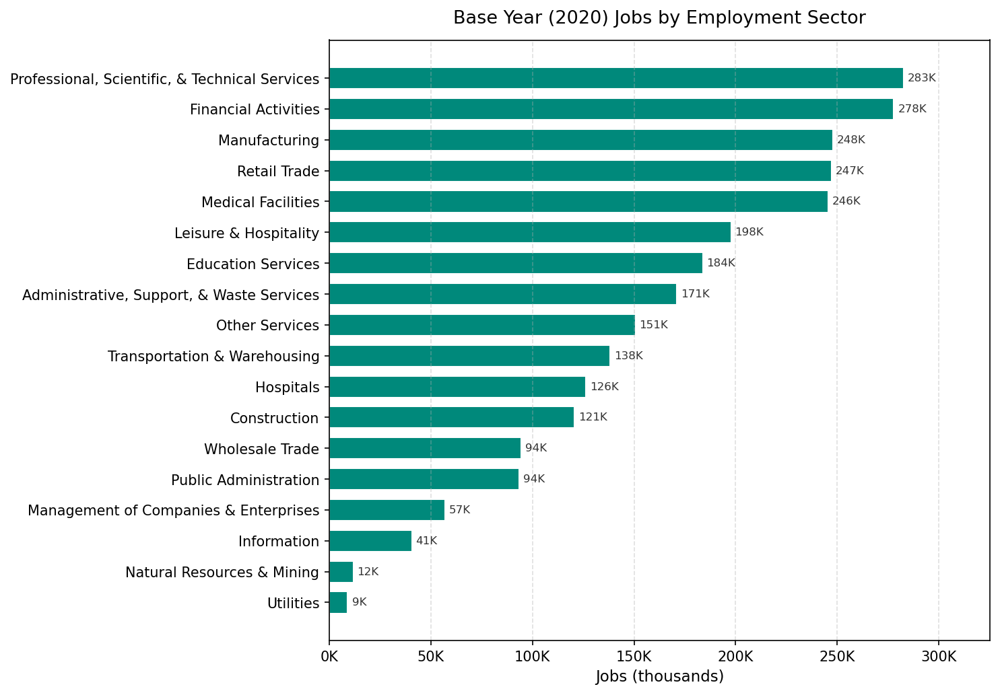

# Employment

**Primary sources:** MDOT employment data (commercial sources including Data Axle), REMI employment model exports

This domain covers the base-year job inventory, annual employment growth control totals, job relocation rates, building capacity parameters, and employment sector definitions.

---

## Tables in This Domain

| Table | Description | Source |
|---|---|---|
| `jobs` | Base-year job inventory (one row per job) | CSV |
| `annual_employment_control_totals` | Target job counts by segment × year | Forecast controls pipeline |
| `annual_relocation_rates_for_jobs` | Job relocation probability by sector | CSV |
| `building_sqft_per_job` | Space required per job by building type | CSV |
| `employment_sectors` | Sector definitions | Constant (prior HDF) |
| `employed_workers_rate` | Employed worker rate by age group, large area, and year | CSV |

---

## `jobs`

Base-year job inventory. One row per job — **not per establishment**. Every job must be assigned to a building. The primary source is MDOT employment data derived from commercial providers (including Data Axle), geocoded to buildings.

**Index:** `job_id` (unique)

| Column | Type | Rules | Notes |
|---|---|---|---|
| `job_id` | int32 | unique, no null | |
| `building_id` | int32 | join → `buildings`, no null | -1 = unplaced (assigned to pseudo-building at startup) |
| `sector_id` | int8 | values: 1–18, no null | Employment sector |
| `home_based_status` | int8 | values: 0, 1 | 0=non-home-based, 1=home-based |
| `sqft` | int16 | no null | Square footage per job |

**Home-based jobs** (value = 1) are located in residential buildings. Non-home-based jobs are in commercial/industrial buildings.

**Common issues:**
- `building_id = -1` — unplaced jobs; should be minimal in base year; large unplaced counts indicate geocoding problems
- `sector_id` outside 1–18 — check against SEMCOG sector mapping
- `building_id` referencing non-existent buildings — re-geocode or assign to nearest valid building
- Total job count by sector × large area for the base year should match REMI base year employment

## `annual_employment_control_totals`

Target job counts by large area × sector × home-based status × year. The `jobs_transition` model step uses this to add or remove jobs annually.

**Index:** Multi-index `(year, sector_id, home_based_status)`  
**Generated by:** A forecast controls pipeline that converts REMI employment exports to SEMCOG 18-sector classifications.

| Column | Type | Allowed Values | Notes |
|---|---|---|---|
| `year` | int16 | all forecast years | Part of multi-index |
| `sector_id` | int8 | 1–18 | Part of multi-index |
| `home_based_status` | int8 | 0, 1 | Part of multi-index |
| `large_area_id` | int16 | 8 valid codes | |
| `total_number_of_jobs` | int32 | no null | Target job count |

**Sample rows** (year 2021, Detroit / large_area_id=161, non-home-based, varied sectors):

| year | sector_id | home_based_status | large_area_id | total_number_of_jobs |
|---|---|---|---|---|
| 2021 | 1 | 0 | 161 | 221 |
| 2021 | 3 | 0 | 161 | 13,035 |
| 2021 | 6 | 0 | 161 | 3,982 |
| 2021 | 10 | 0 | 161 | 19,133 |
| 2021 | 13 | 0 | 161 | 51,581 |

**Important:** All combinations of year × sector × large area × home-based status must be present for all forecast years. Missing cells cause the transition model to skip that segment entirely — jobs in that segment will neither grow nor shrink.

**REMI-to-SEMCOG sector mapping:** REMI uses its own sector classification, which differs from the SEMCOG 18-sector scheme. A crosswalk file maps REMI sectors to SEMCOG sectors. This crosswalk must be applied before generating control totals.

**Common issues:**
- Missing sector/year combinations — model will not grow/shrink those jobs; check that all 18 sectors × 8 large areas × 2 home-based statuses × all years are present
- Base year total jobs across all sectors should approximately match the row count in `jobs`

---

## Employment Sectors

| ID | Name | NAICS |
|---|---|---|
| 1 | Natural Resources & Mining | 11, 21 |
| 2 | Construction | 23 |
| 3 | Manufacturing | 31–33 |
| 4 | Wholesale Trade | 42 |
| 5 | Retail Trade | 44–45 |
| 6 | Transportation & Warehousing | 48–49 |
| 7 | Utilities | 22 |
| 8 | Information | 51 |
| 9 | Financial Activities | 52–53 |
| 10 | Professional, Scientific & Technical Services | 54 |
| 11 | Management of Companies & Enterprises | 55 |
| 12 | Administrative, Support & Waste Services | 56 |
| 13 | Education Services | 61 |
| 14 | Medical Facilities | 621, 623, 624 |
| 15 | Hospitals | 622 |
| 16 | Leisure & Hospitality | 71–72 |
| 17 | Other Services | 81 |
| 18 | Public Administration | 92 |

---

## `annual_relocation_rates_for_jobs`

Annual probability of a job relocating, by sector.

> **Note:** Job relocation is currently **disabled** in the simulation. This table is kept for future use.

**Index:** `sector_id` (unique)

| Column | Type | Rules |
|---|---|---|
| `sector_id` | int8 | values: 1–18, no null |
| `job_relocation_probability` | float64 | no null |

---

## `building_sqft_per_job`

Space required per job by building type. Used to compute building job capacity (`job_spaces = non_residential_sqft / sqft_per_job`).

**Index:** `building_type_id` (unique)

| Column | Type | Notes |
|---|---|---|
| `building_type_id` | int8 | Must cover all non-residential building types |
| `building_sqft_per_job` | int16 | Sq ft per job (typical range: 225–1000) |

Typical values: Office (~300), Retail (~400), Industrial (~550–700), Medical (~225), Institutional (~600).

**Common issues:**
- Missing building types — any non-residential type not in this table will have zero job capacity

---

## `employment_sectors`

Sector definitions. **Constant table** loaded from a prior model input — rarely needs updating.

**Index:** `sector_id` (unique)

| Column | Type | Rules |
|---|---|---|
| `sector_id` | int8 | values: 1–18 |
| `sector_name` | object | |
| `naics_code` | object | no null |
| `naics_sector_description` | object | no null |
| `sqft_per_job` | int16 | no null |

---

## `employed_workers_rate`

The fraction of the population in each age group that is employed, by large area and year. Used by the `fix_lpr` simulation step to adjust the `workers` count in the households table after each year's household transition, keeping the simulated workforce consistent with REMI employment projections.

**Index:** `large_area_id`

| Column | Type | Notes |
|---|---|---|
| `large_area_id` | int16 | 8 valid large area codes — row index |
| `Age_Group` | object | Age group label (e.g., "Ages 16-19") |
| `age_min` | int8 | Lower bound of age group |
| `age_max` | float | Upper bound of age group (NaN for the open-ended oldest group) |
| one column per year | float64 | Employed worker rate for that age group × large area × year (values in [0, 1]) |

**Structure:** 104 rows (8 large areas × 13 age groups), with year columns running from the historical reference period through the end of the forecast horizon.

**Age groups:** 16–19, 20–21, 22–24, 25–29, 30–34, 35–44, 45–54, 55–59, 60–61, 62–64, 65–69, 70–74, 75+.

**Sample rows** — Ages 25-29 across all large areas, showing regional variation:

| large_area_id | Age_Group | age_min | age_max | 2020 | 2025 | 2030 | 2040 | 2050 |
|---|---|---|---|---|---|---|---|---|
| 3 (Wayne excl. Detroit) | Ages 25-29 | 25 | 29 | 0.724 | 0.753 | 0.758 | 0.758 | 0.756 |
| 5 (City of Detroit) | Ages 25-29 | 25 | 29 | 0.680 | 0.737 | 0.740 | 0.744 | 0.751 |
| 93 (Livingston) | Ages 25-29 | 25 | 29 | 0.779 | 0.822 | 0.821 | 0.820 | 0.818 |
| 99 (Macomb) | Ages 25-29 | 25 | 29 | 0.753 | 0.802 | 0.808 | 0.806 | 0.805 |
| 115 (Monroe) | Ages 25-29 | 25 | 29 | 0.748 | 0.788 | 0.797 | 0.803 | 0.799 |
| 125 (Oakland) | Ages 25-29 | 25 | 29 | 0.771 | 0.813 | 0.812 | 0.811 | 0.810 |
| 147 (St. Clair) | Ages 25-29 | 25 | 29 | 0.726 | 0.766 | 0.775 | 0.782 | 0.775 |
| 161 (Washtenaw) | Ages 25-29 | 25 | 29 | 0.754 | 0.803 | 0.804 | 0.803 | 0.802 |

> **Note:** This is **not** the same as the labor force participation rate in the REMI forecast. REMI's labor force participation rate measures the share of the population that is working or actively seeking work. `employed_workers_rate` measures the share that is actually employed, derived by dividing projected employment by projected population for each age group × large area. The two rates differ because labor force participation includes unemployed job-seekers.

**Update:** Derive from REMI employment forecasts by large area, age group, and year. Divide projected employment by projected population in each age group × large area. Update when new REMI runs are available.

**Common issues:**
- All 8 large areas and all 13 age groups must be present (104 rows total)
- Year columns must cover the full simulation range
- Values outside [0, 1] indicate a data error

---

## Update Checklist (New Forecast Cycle)

- [ ] Get new REMI employment export by large area × REMI sector × year
- [ ] Apply REMI-to-SEMCOG sector crosswalk and run the employment controls pipeline
- [ ] Update `jobs` if base year changes — obtain updated MDOT employment data (commercial sources) and geocode to buildings
- [ ] Verify all 18 sectors × 8 large areas × 2 home-based statuses × all forecast years are present in `annual_employment_control_totals`
- [ ] Cross-check: sum of `total_number_of_jobs` for base year ≈ total rows in `jobs`
- [ ] Update `employed_workers_rate` from latest REMI employment projections by age group and large area
- [ ] Confirm all 104 rows (8 large areas × 13 age groups) are present in `employed_workers_rate`
- [ ] Confirm `building_sqft_per_job` covers all non-residential building types
