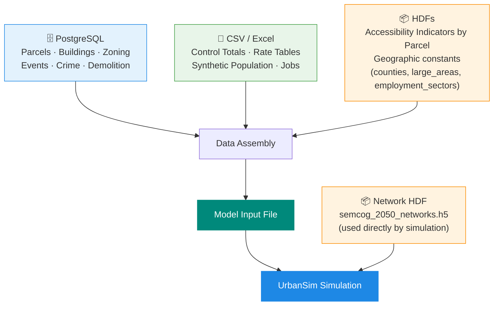
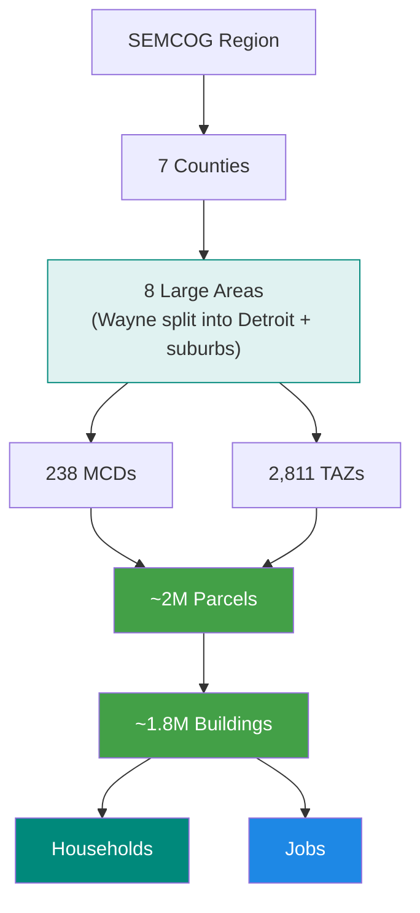

# SEMCOG Forecast Data Wiki

## Purpose

This wiki is the reference guide for data developers who produce and maintain the base year model inputs for the SEMCOG UrbanSim land use simulation. It documents every required data table, organized by the team or data domain responsible for it.

Each domain page describes the expected structure, column definitions, and quality requirements for that domain's data. The final assembly step — combining all inputs into the model input file — is handled by a separate procedure.

> **Forecast context:** This wiki was originally developed based on the RDF2050 forecast inputs (base year 2020) and has been updated to reflect data development for the RDF2055 forecast. For the 2055 forecast, the base year is expected to be 2024 or 2025 rather than 2020. Where this wiki refers to the "base year," readers should substitute the actual base year for the forecast cycle they are working on.

---

## Glossary

| Term | Meaning |
|---|---|
| **UrbanSim** | Agent-based land use simulation model that forecasts household, employment, and building changes year by year |
| **Base year** | The starting year of the simulation. All input tables represent conditions as of this year. The base year is 2020 for the RDF2050 forecast and is expected to be 2024 or 2025 for the RDF2055 forecast |
| **HDF5 / HDF** | A binary data file format used to store all model input tables in one file. Can be opened and inspected with `pandas.HDFStore` in Python or the free [HDFView](https://www.hdfgroup.org/downloads/hdfview/) application |
| **HLCM** | Household Location Choice Model — statistical model that determines where simulated households choose to live each year |
| **ELCM** | Employment Location Choice Model — statistical model that determines where simulated jobs locate each year |
| **TAZ** | Traffic Analysis Zone — the unit of geography used by the travel demand model; parcels are assigned to TAZs |
| **MCD** | Minor Civil Division — cities, townships, and villages. The official geographic unit for municipal-level control |
| **SEMMCD / semmcd** | SEMCOG's internal MCD identifier. This is the primary geography code used throughout the model |
| **city_id** | A column that appears in many tables. **Outside the City of Detroit**, `city_id` equals `semmcd` and refers to a municipality. **Inside the City of Detroit**, `city_id` is a neighborhood identifier, not a municipal code. This is a legacy naming choice — treat `city_id` as "semmcd or Detroit neighborhood id" depending on context |
| **large_area** | One of 8 modeling zones used for forecast segmentation and control totals. Corresponds to Michigan counties by FIPS code, except Wayne County is split into two zones: City of Detroit (code 5) and Wayne County excluding Detroit (code 3) |
| **REMI** | Regional Economic Models, Inc. — the economic forecasting model that produces the population and employment projections used as control totals |
| **PopulationSim** | Open-source population synthesis tool that generates a synthetic base-year population of households and persons matching census distributions |
| **Pandana** | Python library used to compute network-based accessibility indicators (walk/bike/drive travel times and cumulative destination counts) |
| **Proforma** | The developer model's financial feasibility analysis — estimates construction cost vs. expected revenue to determine whether new buildings are profitable to build |

---

## How Inputs Are Assembled — Overview

---

## Data Dependency Chain

The most important structural rule in the model is: **every agent (household or job) must be in a building, and every building must be in a parcel.** This three-level chain is the spatial backbone of the simulation. Referential integrity breaks anywhere in this chain will cause model errors.

> **Real-world alignment note**
>
> The hierarchy above is the intended clean structure. In practice, real-world data introduces boundary complications that data developers should keep in mind:
>
> - **TAZ–parcel boundary mismatch** — TAZ boundaries are designed for travel modeling and do not always align with parcel boundaries. A parcel that physically straddles two TAZ zones is assigned to one TAZ based on its centroid location.
> - **MCD–parcel boundary mismatch** — A small number of parcels may physically cross a municipal boundary. These are assigned to the MCD containing their centroid, which may not reflect the parcel's full extent.
> - **Multi-parcel buildings** — A single building can span multiple parcels (large campuses, industrial complexes). These are tracked separately in the `multi_parcel_buildings` table.
>
> These edge cases are small in number but can affect spatial aggregation and model outputs. **Follow the centroid-based assignment scheme as the standard approach.** When exceptions or unusual cases are encountered during data preparation, document them with a note so the modeling team can assess the impact and develop targeted solutions if needed.

---

## Data Domain Map

Each domain is owned by a different team. Use this table to find who to contact and where to go for each piece of data.

| Domain | Tables | Primary Source |
|---|---|---|
| [Land Use](domains/land-use.md) | `parcels`, `buildings`, `zoning`, `land_use_types`, `building_types`, `multi_parcel_buildings` | PostgreSQL (parcel/building database) |
| [Geography](domains/geography.md) | `zones`, `semmcds`, `counties`, `large_areas` | PostgreSQL (boundary tables) / constant |
| [Demographics](domains/demographics.md) | `households`, `persons`, `annual_household_control_totals`, `remi_pop_total`, relocation rates, `target_vacancies`, `mcd_total`, `bg_hh_increase`, group quarters tables | Population synthesis, REMI, ACS, CSV files |
| [Employment](domains/employment.md) | `jobs`, `annual_employment_control_totals`, `annual_relocation_rates_for_jobs`, `building_sqft_per_job`, `employment_sectors`, `employed_workers_rate` | CSV files, REMI |
| [Development & Context](domains/development-context.md) | `events_addition`, `events_deletion`, `refiner_events`, `demolition_rates`, `landmark_worksites`, `schools`, `crime_rates`, building construction costs | PostgreSQL (event/demo tables), CSV, construction cost estimates |
| [Street Networks](domains/networks.md) | Walk and drive node/edge tables | `semcog_2050_networks.h5` (separate file) |
| [Accessibility](domains/accessibility.md) | `accessibility_walk/bike/drive_indicator_by_parcel`, `transit_stops`, `poi` | Accessibility analysis HDF/CSVs |
| [Travel Data](domains/travel.md) | `travel_data`, `travel_data_2030` | TransCAD OMX → CSV |

---

## How Inputs Are Assembled

Data from all domains is collected and assembled into a single model input file by a separate data assembly procedure. That procedure draws from four source types:

- **PostgreSQL** — parcels, buildings, zoning, events, demolitions, crime rates
- **CSV / Excel files** — control totals, rate tables, synthetic population, jobs, amenities
- **Prior / Reference HDF** — stable tables that do not change between forecast cycles and are carried forward from a previous model input file, plus accessibility indicators by parcel. Includes: `counties`, `large_areas`, `employment_sectors`, and walk/bike/drive indicator tables
- **Network HDF** (`semcog_2050_networks.h5`) — street network geometry used directly by the simulation at runtime; not included in the model input file

Each domain's data developer is responsible for producing their data to the specifications in this wiki. The assembly and final validation steps are handled outside individual domain procedures.

---

## Table Count

The model input file contains **40+ tables**. See the [Table Catalog](reference/table-catalog.md) for a complete alphabetical list with source and index information.

---

<small>Last updated: June 2026</small>
